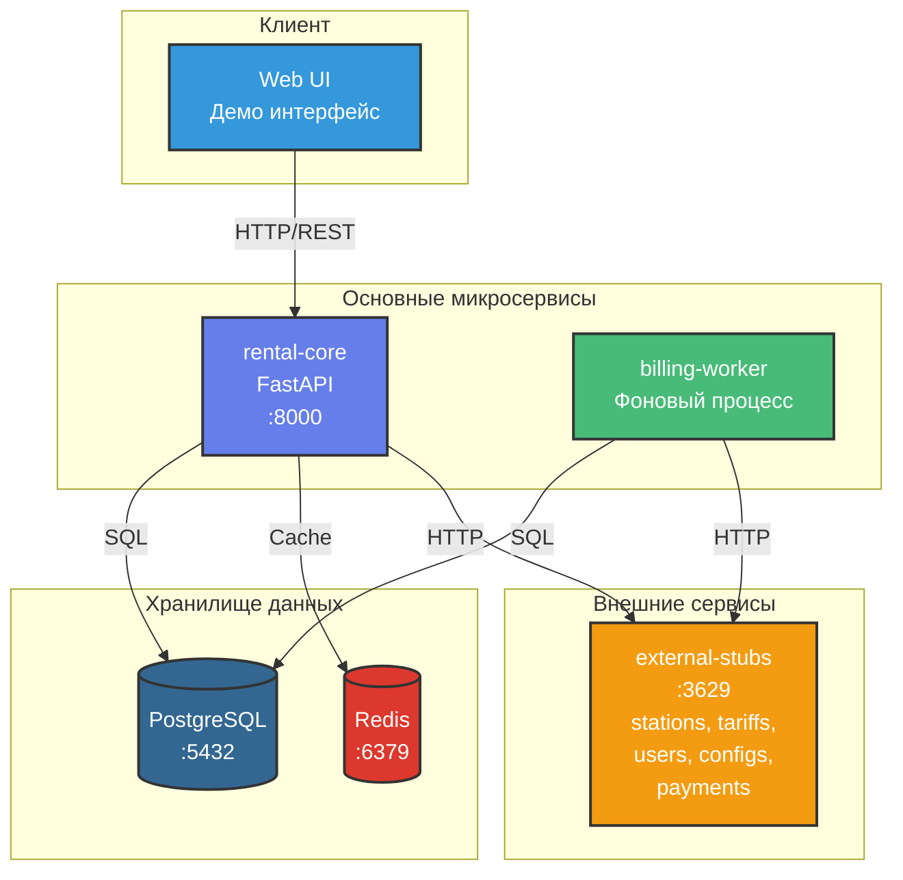

# Архитектура системы аренды пауэрбанков

## Общая схема микросервисов

## Компоненты системы

### rental-core
- **Роль:** Обработка HTTP-запросов пользователей
- **Технологии:** Python 3.11, FastAPI, SQLAlchemy
- **Порт:** 8000
- **Функции:**
  - Создание офферов
  - Старт/стоп аренды
  - Получение статуса
  - Идемпотентность запросов

### billing-worker
- **Роль:** Периодическое начисление и списание платежей
- **Технологии:** Python 3.11, SQLAlchemy
- **Функции:**
  - Расчет начислений каждые 30 сек
  - Списание платежей
  - Управление долгами
  - Автовыкуп при достижении R_BUYOUT

### PostgreSQL
- **Роль:** Основное хранилище данных
- **Таблицы:**
  - rentals - активные аренды
  - quotes - офферы с TTL
  - payment_attempts - аудит платежей
  - debts - долги пользователей
  - idempotency_keys - защита от дублей

### Redis
- **Роль:** Кеширование (опционально)
- **Использование:** Кеш офферов, конфигов

### external-stubs
- **Роль:** Имитация внешних систем
- **Эндпоинты:**
  - /station-data - данные станций
  - /tariff - тарифы
  - /user-profile - профили пользователей
  - /configs - конфигурация
  - /eject-powerbank - выдача банки
  - /hold-money-for-order - удержание депозита
  - /clear-money-for-order - списание средств

