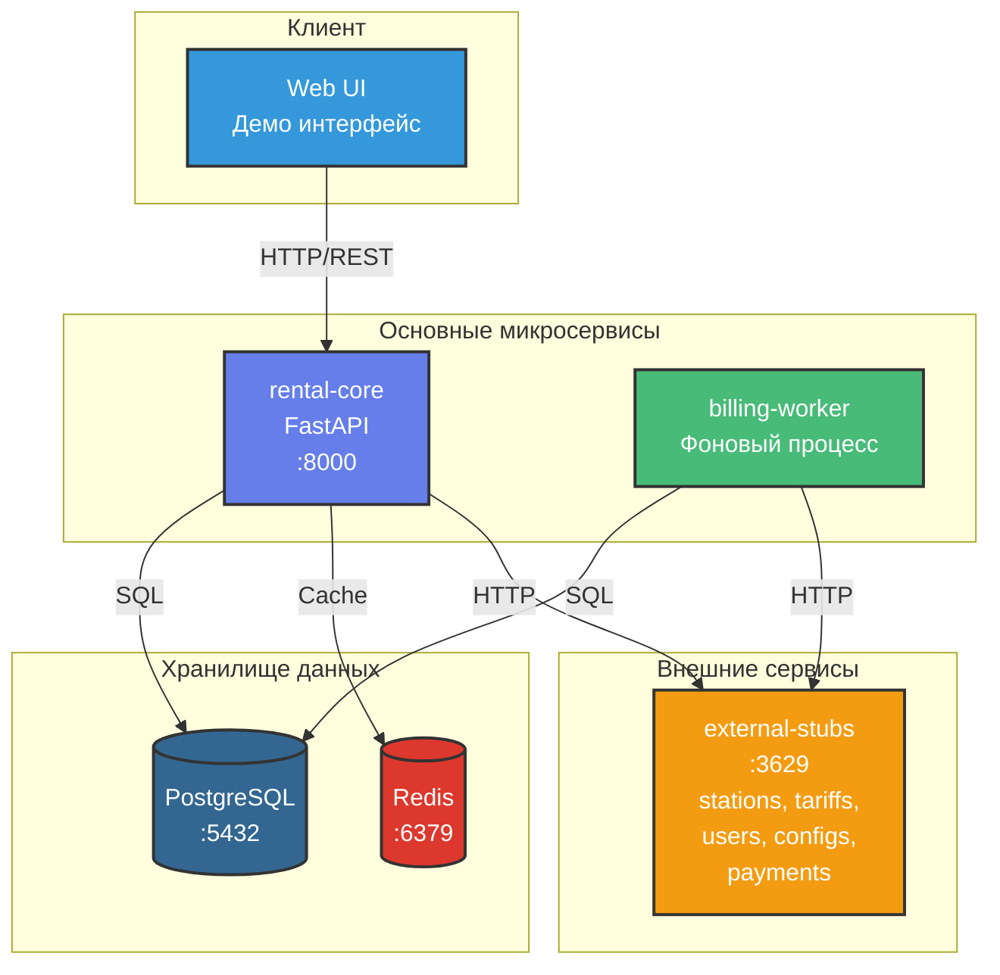
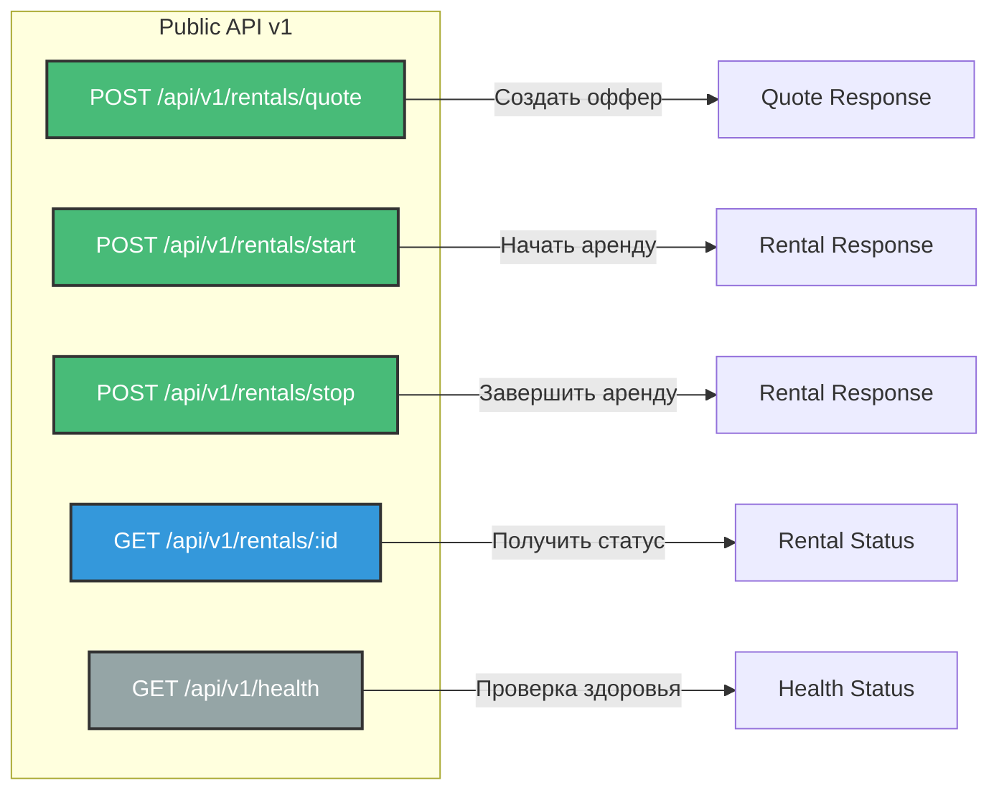

# Архитектура системы аренды пауэрбанков

## Общая схема микросервисов



## Компоненты системы

### rental-core
- **Роль:** Обработка HTTP-запросов пользователей
- **Технологии:** Python 3.11, FastAPI, SQLAlchemy
- **Порт:** 8000
- **Функции:**
  - Создание офферов
  - Старт/стоп аренды
  - Получение статуса
  - Идемпотентность запросов

### billing-worker
- **Роль:** Периодическое начисление и списание платежей
- **Технологии:** Python 3.11, SQLAlchemy
- **Функции:**
  - Расчет начислений каждые 30 сек
  - Списание платежей
  - Управление долгами
  - Автовыкуп при достижении R_BUYOUT

### PostgreSQL
- **Роль:** Основное хранилище данных
- **Таблицы:**
  - rentals - активные аренды
  - quotes - офферы с TTL
  - payment_attempts - аудит платежей
  - debts - долги пользователей
  - idempotency_keys - защита от дублей

### Redis
- **Роль:** Кеширование (опционально)
- **Использование:** Кеш офферов, конфигов

### external-stubs
- **Роль:** Имитация внешних систем
- **Эндпоинты:**
  - /station-data - данные станций
  - /tariff - тарифы
  - /user-profile - профили пользователей
  - /configs - конфигурация
  - /eject-powerbank - выдача банки
  - /hold-money-for-order - удержание депозита
  - /clear-money-for-order - списание средств

---

## API Endpoints

### rental-core REST API



#### POST /api/v1/rentals/quote
**Назначение:** Создание оффера на аренду

**Request:**
```json
{
  "user_id": "user-123",
  "station_id": "station-456"
}
```

**Response 200:**
```json
{
  "quote_id": "quote-789",
  "price_per_hour": 60,
  "free_period_min": 5,
  "deposit": 500,
  "expires_in_sec": 60
}
```

---

#### POST /api/v1/rentals/start
**Назначение:** Начало аренды по офферу

**Headers:**
- `Idempotency-Key: <uuid>` (обязательный)

**Request:**
```json
{
  "quote_id": "quote-789"
}
```

**Response 200:**
```json
{
  "rental_id": "rental-abc",
  "powerbank_id": "pb-001",
  "status": "ACTIVE",
  "started_at": "2025-11-29T10:00:00Z",
  "total_amount": 0
}
```

**Response 400:**
```json
{
  "error": "Quote expired"
}
```

---

#### POST /api/v1/rentals/stop
**Назначение:** Завершение аренды

**Headers:**
- `Idempotency-Key: <uuid>` (обязательный)

**Request:**
```json
{
  "rental_id": "rental-abc",
  "station_id": "station-456"
}
```

**Response 200:**
```json
{
  "rental_id": "rental-abc",
  "status": "FINISHED",
  "started_at": "2025-11-29T10:00:00Z",
  "finished_at": "2025-11-29T11:30:00Z",
  "total_amount": 90,
  "duration_minutes": 90
}
```

---

#### GET /api/v1/rentals/:id
**Назначение:** Получение статуса аренды

**Response 200:**
```json
{
  "rental_id": "rental-abc",
  "status": "ACTIVE",
  "powerbank_id": "pb-001",
  "started_at": "2025-11-29T10:00:00Z",
  "total_amount": 45,
  "current_debt": 0,
  "duration_minutes": 45
}
```

---

#### GET /api/v1/health
**Назначение:** Проверка состояния сервиса

**Response 200:**
```json
{
  "status": "healthy",
  "database": "connected",
  "external_services": {
    "stations": "available",
    "tariffs": "available",
    "users": "available",
    "payments": "available"
  }
}
```

