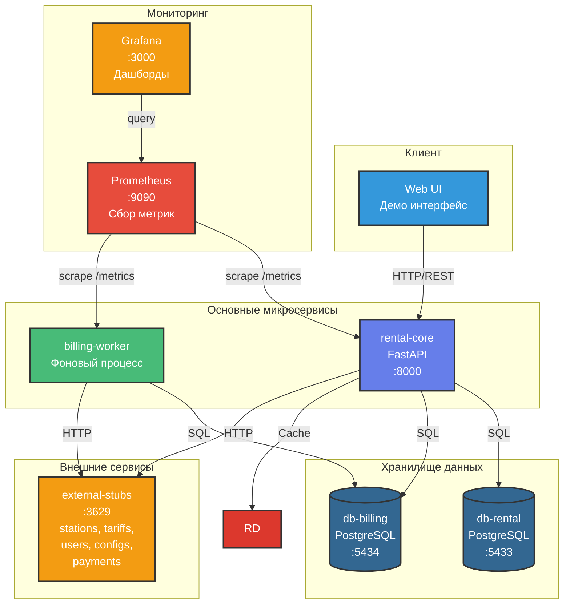
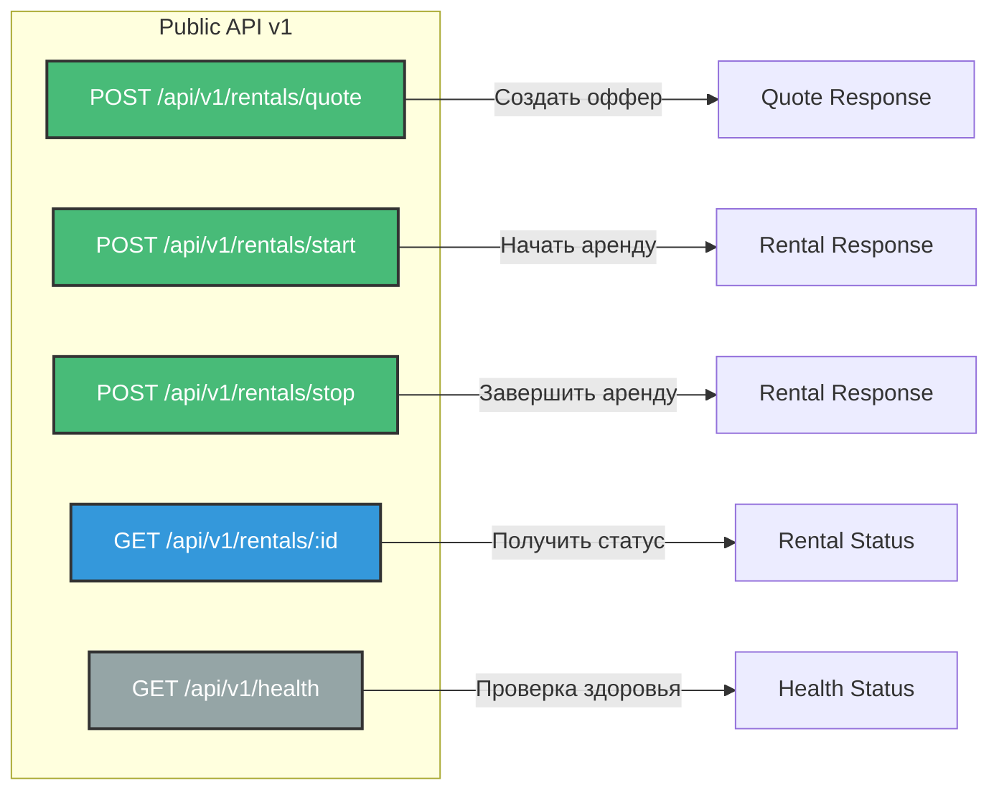
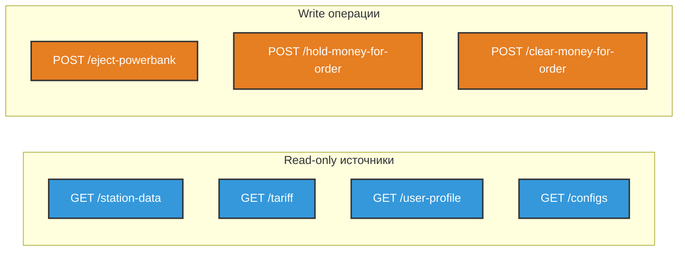

# Архитектура системы аренды пауэрбанков

## Общая схема микросервисов



## Компоненты системы

### rental-core
- **Роль:** Обработка HTTP-запросов пользователей
- **Технологии:** Python 3.11, FastAPI, SQLAlchemy
- **Порт:** 8000
- **Функции:**
  - Создание офферов
  - Старт/стоп аренды
  - Получение статуса
  - Идемпотентность запросов

### billing-worker
- **Роль:** Периодическое начисление и списание платежей
- **Технологии:** Python 3.11, SQLAlchemy
- **Функции:**
  - Расчет начислений каждые 30 сек
  - Списание платежей
  - Управление долгами
  - Автовыкуп при достижении R_BUYOUT

### db-rental (PostgreSQL :5433)
- **Роль:** Хранилище данных rental-core
- **Таблицы:**
  - rentals - активные аренды
  - quotes - офферы с TTL
  - idempotency_keys - защита от дублей

### db-billing (PostgreSQL :5434)
- **Роль:** Хранилище данных billing-worker
- **Таблицы:**
  - rentals - копия для биллинга
  - payment_attempts - аудит платежей
  - debts - долги пользователей

**Разделение БД:** Каждый сервис имеет свою БД для изоляции и независимого масштабирования.

### external-stubs
- **Роль:** Имитация внешних систем
- **Эндпоинты:**
  - /station-data - данные станций
  - /tariff - тарифы
  - /user-profile - профили пользователей
  - /configs - конфигурация
  - /eject-powerbank - выдача банки
  - /hold-money-for-order - удержание депозита
  - /clear-money-for-order - списание средств

### Prometheus (:9090)
- **Роль:** Сбор и хранение метрик
- **Источники метрик:**
  - rental-core:8000/metrics - HTTP запросы, latency, errors
  - billing-worker:8001/metrics - биллинг, долги, начисления
- **Конфигурация:** `monitoring/prometheus/prometheus.yml`
- **Scrape interval:** 10-15 секунд
- **Ключевые метрики:**
  - `http_requests_total` - количество запросов
  - `http_request_duration_seconds` - latency
  - `active_rentals_total` - активные аренды
  - `billing_charges_total` - начисления
  - `debt_collection_success_rate` - успешность списания долгов

### Grafana (:3000)
- **Роль:** Визуализация метрик и дашборды
- **Источник данных:** Prometheus
- **Дашборды:**
  - Rental System Overview - общий обзор системы
  - HTTP Metrics - метрики API
  - Billing Metrics - метрики биллинга
  - Database Metrics - метрики БД (опционально)
- **Конфигурация:** `monitoring/grafana/provisioning/`
- **Автоматическая настройка:** datasources и dashboards через provisioning

---

## API Endpoints

### rental-core REST API



#### POST /api/v1/rentals/quote
**Назначение:** Создание оффера на аренду

**Request:**
```json
{
  "user_id": "user-123",
  "station_id": "station-456"
}
```

**Response 200:**
```json
{
  "quote_id": "quote-789",
  "price_per_hour": 60,
  "free_period_min": 5,
  "deposit": 500,
  "expires_in_sec": 60
}
```

---

#### POST /api/v1/rentals/start
**Назначение:** Начало аренды по офферу

**Headers:**
- `Idempotency-Key: <uuid>` (обязательный)

**Request:**
```json
{
  "quote_id": "quote-789"
}
```

**Response 200:**
```json
{
  "rental_id": "rental-abc",
  "powerbank_id": "pb-001",
  "status": "ACTIVE",
  "started_at": "2025-11-29T10:00:00Z",
  "total_amount": 0
}
```

**Response 400:**
```json
{
  "error": "Quote expired"
}
```

---

#### POST /api/v1/rentals/stop
**Назначение:** Завершение аренды

**Headers:**
- `Idempotency-Key: <uuid>` (обязательный)

**Request:**
```json
{
  "rental_id": "rental-abc",
  "station_id": "station-456"
}
```

**Response 200:**
```json
{
  "rental_id": "rental-abc",
  "status": "FINISHED",
  "started_at": "2025-11-29T10:00:00Z",
  "finished_at": "2025-11-29T11:30:00Z",
  "total_amount": 90,
  "duration_minutes": 90
}
```

---

#### GET /api/v1/rentals/:id
**Назначение:** Получение статуса аренды

**Response 200:**
```json
{
  "rental_id": "rental-abc",
  "status": "ACTIVE",
  "powerbank_id": "pb-001",
  "started_at": "2025-11-29T10:00:00Z",
  "total_amount": 45,
  "current_debt": 0,
  "duration_minutes": 45
}
```

---

#### GET /api/v1/health
**Назначение:** Проверка состояния сервиса

**Response 200:**
```json
{
  "status": "healthy",
  "database": "connected",
  "external_services": {
    "stations": "available",
    "tariffs": "available",
    "users": "available",
    "payments": "available"
  }
}
```

---

## External Services API

### external-stubs (имитация внешних систем)



#### GET /station-data
**Назначение:** Получение данных о станции

**Query params:**
- `id` - ID станции

**Response 200:**
```json
{
  "id": "station-456",
  "tariff_id": "tariff-1",
  "location": {"lat": 55.7558, "lon": 37.6173},
  "available_powerbanks": 5
}
```

---

#### GET /tariff
**Назначение:** Получение тарифа

**Query params:**
- `id` - ID тарифа

**Response 200:**
```json
{
  "id": "tariff-1",
  "price_per_hour": 60,
  "free_period_min": 5,
  "deposit": 500
}
```

---

#### GET /user-profile
**Назначение:** Получение профиля пользователя

**Query params:**
- `id` - ID пользователя

**Response 200:**
```json
{
  "id": "user-123",
  "trusted": true,
  "has_subscription": false
}
```

---

#### GET /configs
**Назначение:** Получение конфигурации системы

**Response 200:**
```json
{
  "R_BUYOUT": 5000,
  "BILLING_TICK_SEC": 30,
  "DEBT_CHARGE_STEP": 100
}
```

---

#### POST /eject-powerbank
**Назначение:** Выдача пауэрбанка из станции

**Request:**
```json
{
  "station_id": "station-456"
}
```

**Response 200:**
```json
{
  "success": true,
  "powerbank_id": "pb-001"
}
```

---

#### POST /hold-money-for-order
**Назначение:** Удержание депозита

**Request:**
```json
{
  "user_id": "user-123",
  "order_id": "rental-abc",
  "amount": 500
}
```

**Response 200:**
```json
{
  "status": "success"
}
```

**Response 400:**
```json
{
  "status": "error",
  "message": "Insufficient funds"
}
```

---

#### POST /clear-money-for-order
**Назначение:** Списание средств

**Request:**
```json
{
  "user_id": "user-123",
  "order_id": "rental-abc",
  "amount": 100
}
```

**Response 200:**
```json
{
  "status": "success"
}
```

**Response 400:**
```json
{
  "status": "error",
  "message": "Insufficient funds"
}
```

