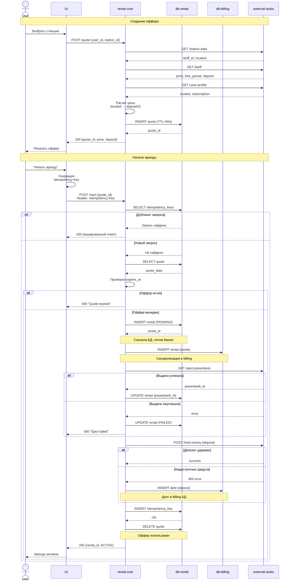

# Последовательность создания аренды

## Полный цикл: от оффера до старта аренды

## Ключевые особенности

### Правильный порядок операций (критично!)
**Проблема:** Если сначала выдать пауэрбанк, а потом записать в БД - при падении БД пользователь получит банку бесплатно.

**Решение:**
1. Сначала создаем запись в БД со статусом `PENDING`
2. Только после успешной записи выдаем пауэрбанк
3. Обновляем `powerbank_id` в БД
4. Если выдача не удалась → помечаем аренду как `FAILED`

**Результат:** Если БД упала - пауэрбанк не выдается. Если выдача упала - есть запись в БД для отладки.

### Идемпотентность
- Каждый запрос `/start` требует уникальный `Idempotency-Key`
- Повторный запрос с тем же ключом возвращает кешированный ответ
- Защита от дублирования аренд при сетевых проблемах

### Контроль свежести оффера
- Оффер живет 60 секунд (`expires_at`)
- При старте аренды проверяется актуальность
- Протухший оффер → ошибка 400

### Fallback для платежей
- Если депозит не удалось удержать → добавляем в долг
- Аренда начинается в любом случае (требование NFR)
- Долг будет списываться периодически billing-worker'ом

### Поглощение оффера
- После успешного старта оффер удаляется
- Один оффер = одна аренда
- Защита от повторного использования

