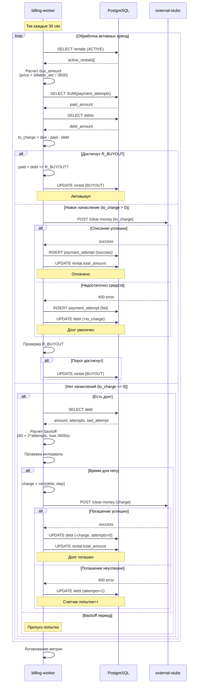

# Процесс биллинга и управления долгами

## Периодическое начисление платежей



## Формула расчета начислений

```
total_seconds = current_time - started_at
free_seconds = free_period_min * 60
billable_seconds = max(0, total_seconds - free_seconds)

due_amount = ceil((price_per_hour * billable_seconds) / 3600)
```

**Пример:**
- Цена: 60 ₽/час
- Бесплатный период: 5 минут
- Прошло времени: 7 минут = 420 секунд
- Начисление: `ceil((60 * (420 - 300)) / 3600) = ceil(2) = 2 ₽`

## Exponential Backoff для долгов

```
Попытка 0: через 60 секунд
Попытка 1: через 120 секунд (60 * 2¹)
Попытка 2: через 240 секунд (60 * 2²)
Попытка 3: через 480 секунд (60 * 2³)
...
Попытка 8+: через 3600 секунд (максимум 1 час)
```

**Цель:** Не перегружать систему платежей при отсутствии средств у пользователя

## Автовыкуп (R_BUYOUT)

**Условие:** `paid_amount + debt_amount >= R_BUYOUT`

**Действие:**
1. Установить `status = 'BUYOUT'`
2. Установить `finished_at = now()`
3. Прекратить начисления
4. Пользователь выкупил пауэрбанк

**Пример:** R_BUYOUT = 5000 ₽
- Если пользователь накатал на 5000 ₽ → банка его
- Долг при этом учитывается (даже если не оплачен)

