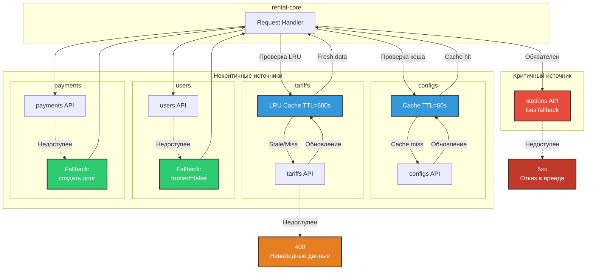
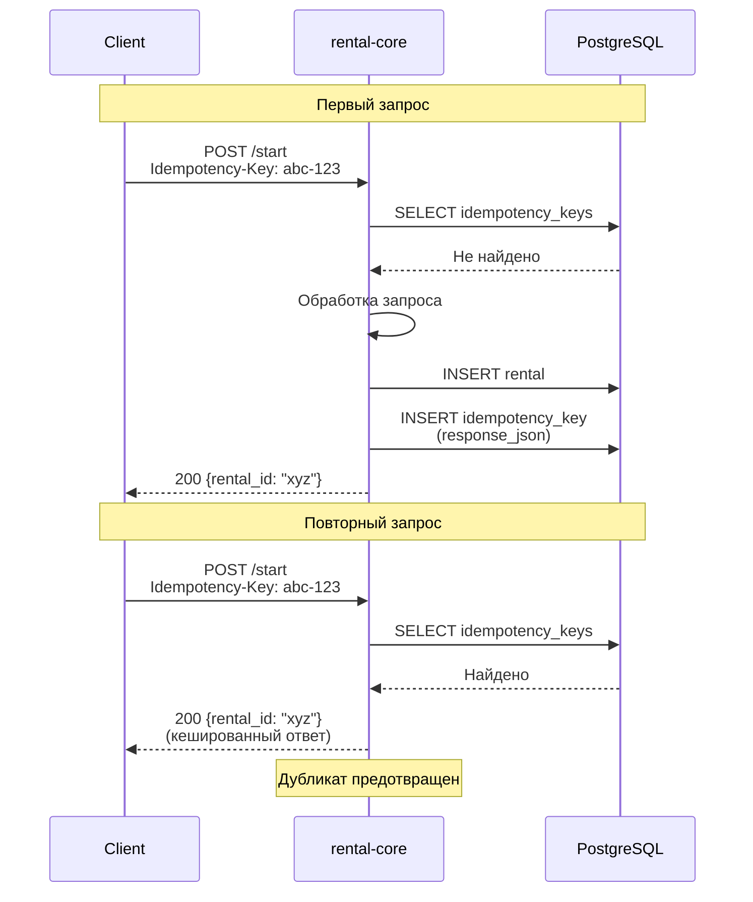

# Паттерны надежности (Reliability)

## Кеширование и Fallback для внешних источников



## Как мы справляемся с падениями внешних сервисов

### 1. stations (Критичный источник)

**Почему критичный:** Без данных о станции мы не знаем, откуда выдавать пауэрбанк и какой тариф применять.

**Что делаем:**
```python
def get_station_data(station_id: str) -> StationData:
    response = requests.get(f"/station-data?id={station_id}", timeout=1.5)
    response.raise_for_status()  # Если упало - пробрасываем ошибку
    return StationData(**response.json())
```

**Если станции недоступны:**
- ❌ Отдаем 5xx ошибку пользователю
- ❌ Аренду не начинаем (иначе не будет понятно, где взять банку)
- Это единственный сервис, без которого мы не работаем

---

### 2. configs (Кешируем на минуту)

**Зачем кеш:** Конфиги меняются редко (R_BUYOUT, таймауты), можно спокойно работать со старыми значениями.

**Как работает:**
```python
class ConfigCache:
    def __init__(self):
        self._cache = None
        self._last_update = None
        self._ttl = 60  # обновляем раз в минуту
    
    def get_config(self, key: str):
        if self._should_refresh():
            try:
                self._cache = requests.get("/configs").json()
                self._last_update = now()
            except Exception:
                # Ничего страшного, работаем со старым кешем
                logger.warning("Config refresh failed, using cached")
        
        return self._cache.get(key, default_value)
```

**Если конфиги упали:**
- ✅ Продолжаем работать со старыми значениями
- ✅ Система не замечает проблемы

---

### 3. tariffs (LRU-кеш на 10 минут)

**Зачем LRU:** Тарифы тоже редко меняются, но их может быть много (по зонам). LRU хранит только популярные.

**Реализация:**
```python
from cachetools import TTLCache

class ExternalClient:
    def __init__(self):
        self._tariff_cache = TTLCache(maxsize=1024, ttl=600)  # 10 минут
    
    def get_tariff(self, zone_id: str) -> Tariff:
        @cached(cache=self._tariff_cache)
        def _get_tariff_cached(zone_id: str) -> Tariff:
            response = requests.get(f"/tariff?id={zone_id}")
            response.raise_for_status()
            return Tariff(**response.json())
        
        return _get_tariff_cached(zone_id)
```

**Если тарифы упали:**
- ✅ Используем закешированный тариф (если он свежий)
- ❌ Если тарифа нет в кеше или он протух → отдаем 400 (лучше отказать, чем взять неправильную цену)

---

### 4. users (Fallback на жадный прайсинг)

**Идея:** Если не знаем, доверенный ли пользователь - считаем, что не доверенный. Берем максимальный депозит.

**Код:**
```python
def get_user_profile(self, user_id: str) -> UserProfile:
    try:
        response = requests.get(f"/user-profile?id={user_id}", timeout=1.5)
        response.raise_for_status()
        profile = UserProfile(**response.json())
        profile._from_fallback = False
        return profile
    except Exception as e:
        logger.warning(f"User profile unavailable, using fallback: {e}")
        # Жадный прайсинг - берем по максимуму
        profile = UserProfile(
            id=user_id,
            trusted=False,        # не доверяем
            has_subscription=False  # без скидок
        )
        profile._from_fallback = True
        return profile
```

**Что значит "жадный":**
- `trusted=False` → депозит не уменьшаем (берем полный)
- `has_subscription=False` → скидки не даем

**Если users упал:**
- ✅ Работаем с fallback-профилем
- ✅ Аренда начинается, но с максимальным депозитом
- Пользователь не в плюсе, но и мы не в минусе

---

### 5. payments (Fallback на долг)

**Философия:** Лучше дать пользователю аренду и записать долг, чем отказать из-за временных проблем с платежами.

**Реализация:**
```python
def hold_money_with_fallback(self, user_id: str, order_id: str, amount: int):
    success, error = self.external_client.hold_money_for_order(
        user_id, order_id, amount
    )
    
    if not success:
        logger.warning(f"Payment hold failed, creating debt: {error}")
        # Записываем долг и идем дальше
        self.debt_repo.attach_debt(order_id, amount, now())
        # Аренда всё равно начинается!
```

**Если платежи упали:**
- ✅ Депозит записываем как долг
- ✅ Аренда начинается нормально
- ✅ billing-worker потом попробует списать долг
- Пользователь доволен, деньги не потеряем

---

## Автоматические retry при сетевых глюках

**Проблема:** Иногда внешний сервис тупит секунду и отдает 503, а через секунду уже работает. Не хочется падать из-за этого.

**Решение:** Настраиваем автоматические повторы с увеличивающимся интервалом.

```python
from urllib3.util.retry import Retry
from requests.adapters import HTTPAdapter

session = requests.Session()
retries = Retry(
    total=3,                          # Пробуем максимум 3 раза
    connect=3,                        # 3 попытки подключиться
    read=3,                           # 3 попытки прочитать ответ
    backoff_factor=0.3,               # Ждем 0.3s, потом 0.6s, потом 1.2s
    status_forcelist=(502, 503, 504), # Повторяем при этих ошибках
    allowed_methods=frozenset({"GET", "POST"}),
    raise_on_status=False
)
adapter = HTTPAdapter(max_retries=retries)
session.mount("http://", adapter)
session.mount("https://", adapter)
```

**Что это дает:**
- Кратковременный лаг сети? Переждем и повторим
- Сервис перезагружается и отдает 503? Подождем секунду и попробуем еще раз
- Надежность растет без изменения бизнес-логики

---

## Идемпотентность



**От чего защищает:**
- Пользователь нажал "Начать аренду" дважды → создастся только одна аренда
- Сеть глючит, запрос ушел дважды → депозит спишется один раз
- Пауэрбанк выдастся только один раз, не два

**Важно:** Клиент должен генерировать UUID и слать его в заголовке `Idempotency-Key`. Если ключ повторяется - отдаем старый ответ.

---

## Итоговая таблица: Reliability

| Источник | Насколько критичен | Что делаем | Если упал |
|----------|-------------------|------------|-----------|
| stations | ✅ Очень критичный | Просто ходим | 5xx, отказываем в аренде |
| configs | ⚠️ Можно без него | Кешируем 60 сек | Работаем со старым кешем |
| tariffs | ⚠️ Можно без него | LRU кеш 10 мин | Используем кеш или отказываем |
| users | ⚠️ Можно без него | Fallback профиль | Жадный прайсинг (макс. депозит) |
| payments | ⚠️ Можно без него | Записываем долг | Долг + аренда работает |

**Результат:** Система деградирует плавно, но не падает полностью. Единственный критичный сервис - станции (без них физически не выдать банку).

