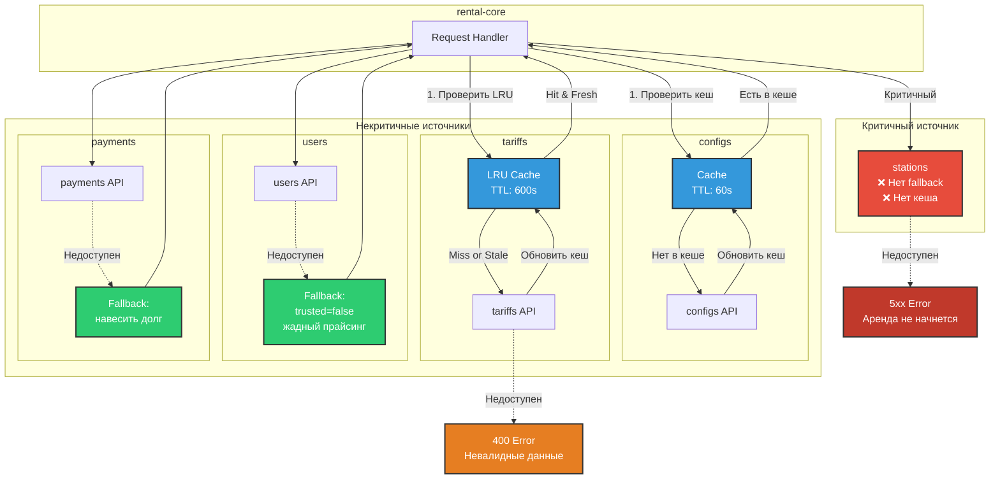
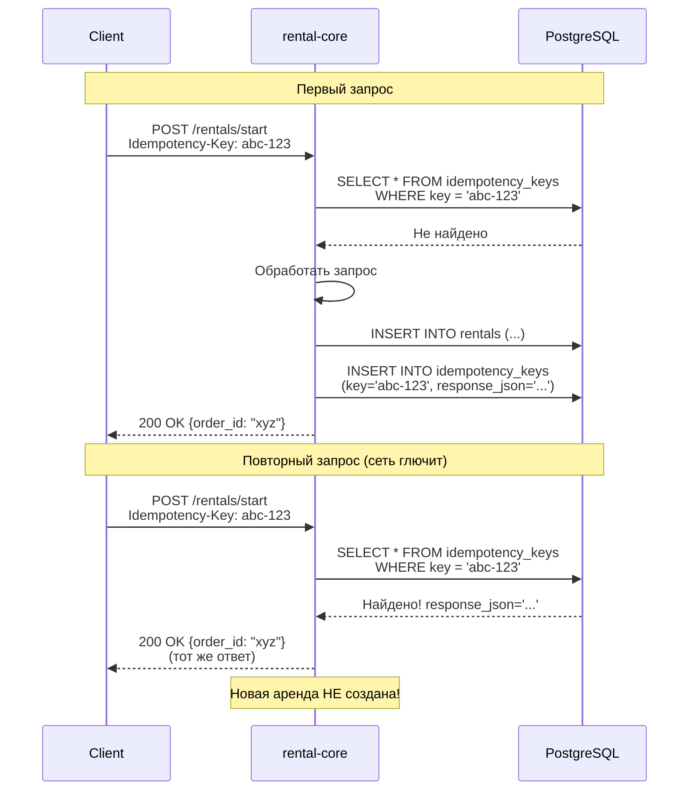

# Паттерны надежности (Reliability)

## Кеширование и Fallback для внешних источников



## Детали реализации

### 1. stations (Критичный)

**Требование:** Без станции аренду начать нельзя

**Реализация:**
```python
def get_station_data(station_id: str) -> StationData:
    response = requests.get(f"/station-data?id={station_id}", timeout=1.5)
    response.raise_for_status()  # Пробросить ошибку наверх
    return StationData(**response.json())
```

**При недоступности:**
- ❌ Запрос падает с 5xx
- ❌ Аренда не начинается
- ✅ Пользователь видит ошибку

---

### 2. configs (Некритичный, кеш 60 сек)

**Требование:** Кеш, обновляемый каждую минуту

**Реализация:**
```python
class ConfigCache:
    def __init__(self):
        self._cache = None
        self._last_update = None
        self._ttl = 60  # секунд
    
    def get_config(self, key: str):
        if self._should_refresh():
            try:
                self._cache = requests.get("/configs").json()
                self._last_update = now()
            except Exception:
                # Используем старый кеш
                logger.warning("Config refresh failed, using cached")
        
        return self._cache.get(key, default_value)
```

**При недоступности:**
- ✅ Используется старый кеш
- ✅ Система продолжает работать

---

### 3. tariffs (Некритичный, LRU-кеш 10 минут)

**Требование:** LRU-кэш, данные старше 10 минут невалидны

**Реализация:**
```python
from cachetools import TTLCache

class ExternalClient:
    def __init__(self):
        self._tariff_cache = TTLCache(maxsize=1024, ttl=600)  # 10 минут
    
    def get_tariff(self, zone_id: str) -> Tariff:
        @cached(cache=self._tariff_cache)
        def _get_tariff_cached(zone_id: str) -> Tariff:
            response = requests.get(f"/tariff?id={zone_id}")
            response.raise_for_status()
            return Tariff(**response.json())
        
        return _get_tariff_cached(zone_id)
```

**При недоступности:**
- ✅ Если в кеше и < 10 минут → используем
- ❌ Если нет в кеше или > 10 минут → ошибка 400

---

### 4. users (Некритичный, fallback)

**Требование:** Фоллбэк, давать жадный прайсинг

**Реализация:**
```python
def get_user_profile(self, user_id: str) -> UserProfile:
    try:
        response = requests.get(f"/user-profile?id={user_id}", timeout=1.5)
        response.raise_for_status()
        profile = UserProfile(**response.json())
        profile._from_fallback = False
        return profile
    except Exception as e:
        logger.warning(f"User profile unavailable, using fallback: {e}")
        # Жадный прайсинг: не trusted, нет подписки
        profile = UserProfile(
            id=user_id,
            trusted=False,
            has_subscription=False
        )
        profile._from_fallback = True
        return profile
```

**Жадный прайсинг:**
- `trusted=False` → депозит не уменьшается
- `has_subscription=False` → нет скидок

**При недоступности:**
- ✅ Используется fallback профиль
- ✅ Аренда начинается с максимальным депозитом

---

### 5. payments (Некритичный, fallback)

**Требование:** Если платежи недоступны, навешивать долг, пускать в аренду

**Реализация:**
```python
def hold_money_with_fallback(self, user_id: str, order_id: str, amount: int):
    success, error = self.external_client.hold_money_for_order(
        user_id, order_id, amount
    )
    
    if not success:
        logger.warning(f"Payment hold failed, creating debt: {error}")
        # Навешиваем долг
        self.debt_repo.attach_debt(order_id, amount, now())
        # ✅ Аренда продолжается!
```

**При недоступности:**
- ✅ Депозит идет в долг
- ✅ Аренда начинается
- ✅ Долг будет списываться позже billing-worker'ом

---

## HTTP Retry стратегия

```python
from urllib3.util.retry import Retry
from requests.adapters import HTTPAdapter

session = requests.Session()
retries = Retry(
    total=3,                          # Максимум 3 попытки
    connect=3,                        # 3 попытки на connect
    read=3,                           # 3 попытки на read
    backoff_factor=0.3,               # 0.3, 0.6, 1.2 секунд
    status_forcelist=(502, 503, 504), # Retry на этих статусах
    allowed_methods=frozenset({"GET", "POST"}),
    raise_on_status=False
)
adapter = HTTPAdapter(max_retries=retries)
session.mount("http://", adapter)
session.mount("https://", adapter)
```

**Эффект:**
- Временные сбои сети → автоматический retry
- 502/503/504 от внешних сервисов → retry
- Увеличивает reliability без изменения кода

---

## Идемпотентность



**Защита от:**
- Дублирования аренд при сетевых проблемах
- Двойного списания депозита
- Повторной выдачи пауэрбанка

---

## Итого: Reliability

| Источник | Критичность | Стратегия | При недоступности |
|----------|-------------|-----------|-------------------|
| stations | ✅ Критичный | Нет fallback | 5xx, аренда не начнется |
| configs | ⚠️ Некритичный | Кеш 60s | Старый кеш |
| tariffs | ⚠️ Некритичный | LRU 600s | Кеш или 400 |
| users | ⚠️ Некритичный | Fallback | Жадный прайсинг |
| payments | ⚠️ Некритичный | Fallback | Долг, аренда OK |

**Результат:** Система деградирует gracefully, но продолжает работать

