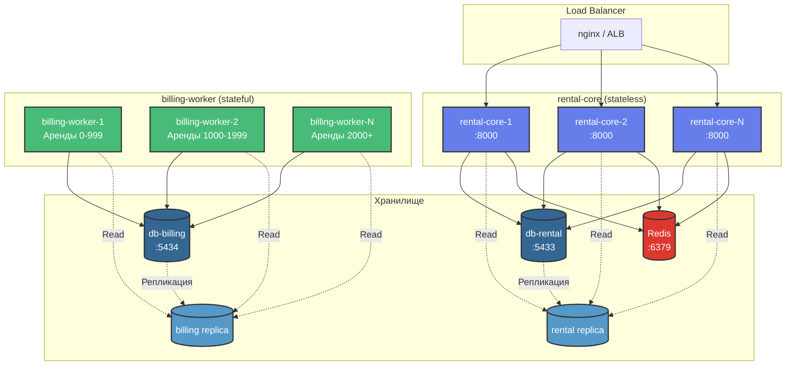

# Масштабируемость системы (Scalability)

## Параметры нагрузки (Команда 8)

```
X = 10 RPS  - создание аренд (/rentals/start)
Y = 10      - пользователей, просматривающих статус
Z = 1 KB    - размер записи об аренде
```

## Горизонтальное масштабирование



## Считаем нагрузку

### Сколько запросов летит в API

**Запросы на запись:**
```
POST /rentals/quote:  ~10 RPS (пользователи создают офферы)
POST /rentals/start:  ~10 RPS (начинают аренду)
POST /rentals/stop:   ~10 RPS (возвращают банки)
-----------------------------------
Итого write:          ~30 RPS
```

**Запросы на чтение:**
```
GET /rentals/{id}/status: Y / 60 = 10 / 60 ≈ 0.17 RPS
(каждый пользователь смотрит статус 10 раз за всю аренду)
```

**Всего:** ~30 RPS write + 0.2 RPS read = **30.2 RPS** (легкая нагрузка)

### Что происходит с базой данных

**Один запрос /start делает:**
- 1 SELECT - проверяем, не дубликат ли (idempotency_key)
- 1 SELECT - достаем оффер
- 1 DELETE - удаляем использованный оффер
- 1 INSERT - создаем аренду
- 1 INSERT - сохраняем idempotency_key
- 0-1 INSERT - если платеж не прошел, создаем долг

**Итого:** ~50-60 запросов в БД в секунду (легко)

**Billing-worker работает каждые 30 секунд:**
- 1 SELECT - берем все активные аренды
- N × 3 SELECT - для каждой аренды читаем rental, payments, debts
- N × 1-2 INSERT/UPDATE - записываем payment_attempt и обновляем rental/debt

**Если активных аренд 100:** ~600 операций каждые 30 сек = **20 операций/сек**

**Итого нагрузка на БД:** ~80 операций/сек (PostgreSQL переживет)

### Сколько места займет в базе

**За час работы (X = 10 RPS):**
```
10 аренд/сек × 3600 сек = 36,000 аренд
36,000 × 1 KB = 36 MB (почти ничего)
```

**За сутки:**
```
864,000 аренд × 1 KB ≈ 864 MB (меньше гигабайта)
```

**За месяц:**
```
~25,000,000 аренд × 1 KB ≈ 25 GB
```

**С учетом всех попыток платежей и долгов:**
```
25 GB × 1.5 ≈ 37.5 GB/месяц (влезет на обычный SSD)
```

Вывод: при X=10 RPS места нужно мало, можно годами не чистить.

## Как масштабировать, если нагрузка вырастет

### 1. rental-core (легко масштабируется)

**Почему легко:**
- ✅ Не хранит состояние - каждый запрос независим
- ✅ Идемпотентность через БД, а не в памяти
- ✅ Можно просто запустить больше копий

**Как добавить инстансов:**
```yaml
# docker-compose.yml
rental-core:
  deploy:
    replicas: 3  # Было 1, стало 3 - втрое больше мощности
```

**Load Balancer на выбор:**
- nginx с round-robin (самое простое)
- AWS ALB / GCP Load Balancer (если в облаке)
- Kubernetes Service (если на k8s)

**Когда пора масштабировать:**
- CPU > 70% → добавляем инстанс
- Latency p95 > 500ms → добавляем инстанс
- RPS на один инстанс > 50 → добавляем инстанс

---

### 2. billing-worker (сложнее масштабируется)

**Проблема:**
- ⚠️ Нельзя просто запустить 10 копий - они будут обрабатывать одни и те же аренды
- ⚠️ Нужна координация, чтобы не списать деньги дважды

**Вариант 1: Шардирование по rental_id**
```python
# Worker 1 берет аренды, где rental_id % 3 == 0
# Worker 2 берет аренды, где rental_id % 3 == 1
# Worker 3 берет аренды, где rental_id % 3 == 2

def get_active_rental_ids(self, shard_id: int, total_shards: int):
    return [
        r_id for r_id in all_active_rentals
        if hash(r_id) % total_shards == shard_id
    ]
```
Плюс: легко реализовать. Минус: нужно перезапускать все воркеры при изменении их числа.

**Вариант 2: Работаем по очереди**
```python
# Worker 1 работает в 00:00, 00:02, 00:04...
# Worker 2 работает в 00:01, 00:03, 00:05...

import time
worker_id = 0
total_workers = 2

while True:
    if int(time.time() / 30) % total_workers == worker_id:
        process_all_rentals()
    time.sleep(30)
```
Плюс: простота. Минус: воркеры простаивают.

**Вариант 3: Leader Election (для прода)**
```python
# Используем Redis или etcd
# Один воркер активен, остальные в standby на случай падения
```
Плюс: надежность. Минус: сложность реализации.

---

### 3. PostgreSQL (две отдельные БД)

**Почему две БД:**
- `db-rental` (:5433) - для rental-core (офферы, аренды, идемпотентность)
- `db-billing` (:5434) - для billing-worker (платежи, долги)
- Изоляция: падение одной БД не влияет на другую
- Независимое масштабирование под разную нагрузку

**Вертикальное масштабирование (проще всего):**
- Купить сервер помощнее (больше CPU/RAM)
- Поставить SSD вместо HDD (в разы быстрее)
- Подкрутить настройки (shared_buffers, work_mem)

**Горизонтальное масштабирование:**
```
db-rental Master → rental Replica (для чтения статусов)
db-billing Master → billing Replica (для аналитики)
```

**Как разделить нагрузку:**
```python
# rental-core пишет в db-rental
rental_repo.create_rental(rental)  # → db-rental Master

# Чтение статусов из реплики
rental_repo.get_rental_status(order_id)  # → db-rental Replica

# billing-worker работает с db-billing
billing_service.process_charges()  # → db-billing Master
```

**Обязательные индексы:**
```sql
-- db-rental
CREATE INDEX idx_rentals_status ON rentals(status);
CREATE INDEX idx_rentals_user_id ON rentals(user_id);
CREATE INDEX idx_quotes_expires_at ON quotes(expires_at);

-- db-billing
CREATE INDEX idx_payment_attempts_rental_id ON payment_attempts(rental_id);
CREATE INDEX idx_debts_last_attempt ON debts(last_attempt_at);
```

---

### 4. Redis (кеш)

**Зачем нужен:**
- Кешируем офферы (живут 60 сек)
- Кешируем тарифы (живут 10 минут)
- Кешируем конфиги (живут 1 минуту)
- Можно хранить сессии

**Если Redis упадет:** ничего страшного, просто будет чуть медленнее (пойдем в БД).

**Масштабирование:**
```
Redis Cluster (3 мастера + 3 реплики)
```
Но при X=10 RPS хватит одного инстанса.

---

## Сколько железа нужно

### Для нашей нагрузки X = 10 RPS

**rental-core:**
- 2 инстанса × 2 CPU × 4 GB RAM
- Каждый справится с ~15 RPS (есть запас)

**billing-worker:**
- 1 инстанс × 1 CPU × 2 GB RAM
- Потянет до 1000 активных аренд

**db-rental (PostgreSQL):**
- 1 master × 2 CPU × 8 GB RAM (для rental-core)
- 1 replica × 1 CPU × 4 GB RAM (опционально, для чтения)

**db-billing (PostgreSQL):**
- 1 master × 2 CPU × 8 GB RAM (для billing-worker)
- 1 replica × 1 CPU × 4 GB RAM (опционально, для аналитики)

**Redis:**
- 1 инстанс × 1 CPU × 2 GB RAM (хватит с головой)

**external-stubs:**
- 1 инстанс × 1 CPU × 1 GB RAM (заглушка)

**Итого:** ~13 CPU, ~37 GB RAM (без реплик: ~9 CPU, ~25 GB RAM)

---

### Если нагрузка вырастет в 10 раз (X = 100 RPS)

**rental-core:**
- 6 инстансов × 2 CPU × 4 GB RAM
- Каждый справится с ~17 RPS

**billing-worker:**
- 3 инстанса × 2 CPU × 4 GB RAM
- Делим аренды между ними (шардирование)

**db-rental:**
- 1 master × 4 CPU × 16 GB RAM
- 2 replicas × 2 CPU × 8 GB RAM (для read)

**db-billing:**
- 1 master × 4 CPU × 16 GB RAM
- 1 replica × 2 CPU × 8 GB RAM

**Redis:**
- 3 ноды в кластере × 2 CPU × 4 GB RAM

**Итого:** ~50 CPU, ~140 GB RAM

---

## Узкие места и как их решать

| Что тормозит | Как понять | Что делать |
|------------|----------|---------|
| rental-core не справляется | Высокая latency, таймауты | Добавить инстансов |
| PostgreSQL медленно пишет | Slow INSERT/UPDATE | Мощнее сервер, проверить индексы |
| PostgreSQL медленно читает | Slow SELECT | Добавить реплики, больше кеша |
| billing-worker не успевает | Долги растут, обработка > 30 сек | Шардирование, больше воркеров |
| external-stubs тормозят | Таймауты | Увеличить timeout, retry, кеш |

---

## Что мониторить

### Стек мониторинга: Prometheus + Grafana

**Prometheus (:9090)** собирает метрики каждые 10-15 секунд:
- rental-core:8000/metrics
- billing-worker:8001/metrics

**Grafana (:3000)** визуализирует метрики в дашбордах:
- Rental System Overview - общий обзор
- HTTP Metrics - API метрики
- Billing Metrics - метрики биллинга

### Ключевые метрики:

**HTTP метрики (rental-core):**
- `http_requests_total` - RPS (запросов в секунду)
- `http_request_duration_seconds` - Latency (p50, p95, p99)
- `http_requests_errors_total` - Error rate (4xx, 5xx)

**Бизнес метрики:**
- `active_rentals_total` - Активные аренды
- `billing_charges_total` - Начисления
- `debt_collection_success_rate` - Успешность списания долгов
- `quote_creation_total` - Созданные офферы

**Инфраструктура:**
- DB connections pool usage
- Redis cache hit rate
- External API response time

### Алерты (когда бить тревогу):

**Производительность:**
- Latency p95 > 1s → Добавить инстансы rental-core
- Error rate > 1% → Проверить логи и внешние сервисы
- RPS > 50 на инстанс → Масштабировать

**Ресурсы:**
- DB connections > 80% → Увеличить pool или добавить реплики
- Active rentals > 5000 → Масштабировать billing-worker
- Redis memory > 80% → Увеличить память или добавить ноды

**Бизнес:**
- Debt collection rate < 50% → Проблемы с платежами
- Quote to rental conversion < 30% → UX проблемы

### Дополнительные инструменты (опционально):
- ELK Stack - для анализа логов
- Jaeger / OpenTelemetry - для трейсинга запросов

