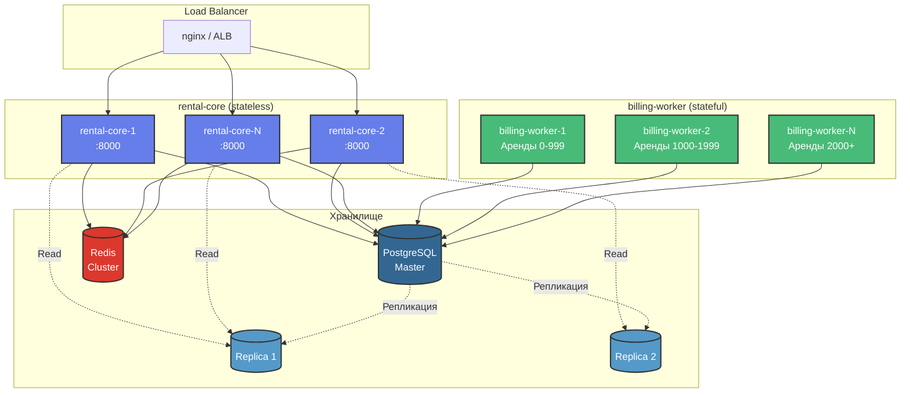

# Масштабируемость системы (Scalability)

## Параметры нагрузки (Команда 8)

```
X = 10 RPS  - создание аренд (/rentals/start)
Y = 10      - пользователей, просматривающих статус
Z = 1 KB    - размер записи об аренде
```

## Горизонтальное масштабирование



## Расчет нагрузки

### HTTP запросы

**Write операции:**
```
POST /rentals/quote:  ~10 RPS (X)
POST /rentals/start:  ~10 RPS (X)
POST /rentals/stop:   ~10 RPS (равномерно распределено)
-----------------------------------
Итого write:          ~30 RPS
```

**Read операции:**
```
GET /rentals/{id}/status: Y / 60 = 10 / 60 ≈ 0.17 RPS
```

**Итого:** ~30 RPS write + 0.2 RPS read = **30.2 RPS**

### Нагрузка на БД

**На один /start (10 RPS):**
- 1 SELECT (проверка idempotency_key)
- 1 SELECT (загрузка quote)
- 1 DELETE (поглощение quote)
- 1 INSERT (создание rental)
- 1 INSERT (idempotency_key)
- 0-1 INSERT (debt, если платеж не прошел)

**Итого:** ~50-60 операций/сек для write

**Billing-worker (каждые 30 сек):**
- 1 SELECT (список активных аренд)
- N × 3 SELECT (для каждой аренды: rental, payments, debts)
- N × 1-2 INSERT/UPDATE (payment_attempt, debt/rental)

**При 100 активных арендах:** ~600 операций каждые 30 сек = **20 операций/сек**

**Итого БД:** ~80 операций/сек

### Хранение данных

**За час (X = 10 RPS):**
```
10 RPS × 3600 сек = 36,000 аренд
36,000 × 1 KB = 36 MB
```

**За сутки:**
```
864,000 аренд × 1 KB ≈ 864 MB
```

**За месяц:**
```
~25,000,000 аренд × 1 KB ≈ 25 GB
```

**С учетом payment_attempts и debts:**
```
25 GB × 1.5 ≈ 37.5 GB/месяц
```

## Стратегии масштабирования

### 1. rental-core (Stateless)

**Характеристики:**
- ✅ Не хранит состояние между запросами
- ✅ Идемпотентность через БД
- ✅ Можно масштабировать горизонтально

**Масштабирование:**
```yaml
# docker-compose.yml
rental-core:
  deploy:
    replicas: 3  # Увеличить при росте X
```

**Load Balancing:**
- nginx с round-robin
- AWS ALB / GCP Load Balancer
- Kubernetes Service

**Метрики для масштабирования:**
- CPU > 70% → добавить реплику
- Latency p95 > 500ms → добавить реплику
- RPS на инстанс > 50 → добавить реплику

---

### 2. billing-worker (Stateful)

**Характеристики:**
- ⚠️ Обрабатывает активные аренды
- ⚠️ Нужна координация между воркерами

**Стратегия 1: Шардирование по rental_id**
```python
# Worker 1 обрабатывает rental_id % 3 == 0
# Worker 2 обрабатывает rental_id % 3 == 1
# Worker 3 обрабатывает rental_id % 3 == 2

def get_active_rental_ids(self, shard_id: int, total_shards: int):
    return [
        r_id for r_id in all_active_rentals
        if hash(r_id) % total_shards == shard_id
    ]
```

**Стратегия 2: Временное разделение**
```python
# Worker 1 работает в 00:00, 00:02, 00:04...
# Worker 2 работает в 00:01, 00:03, 00:05...

import time
worker_id = 0
total_workers = 2

while True:
    if int(time.time() / 30) % total_workers == worker_id:
        process_all_rentals()
    time.sleep(30)
```

**Стратегия 3: Leader Election (для production)**
```python
# Используя Redis или etcd
# Только один worker активен, остальные в standby
```

---

### 3. PostgreSQL

**Вертикальное масштабирование:**
- Увеличить CPU/RAM
- SSD вместо HDD
- Оптимизация параметров (shared_buffers, work_mem)

**Горизонтальное масштабирование:**
```
Master (Write) → Replicas (Read)
```

**Разделение нагрузки:**
```python
# Write в master
rental_repo.create_rental(rental)  # → Master

# Read из replica
rental_repo.get_rental_status(order_id)  # → Replica
```

**Индексы:**
```sql
CREATE INDEX idx_rentals_status ON rentals(status);
CREATE INDEX idx_rentals_user_id ON rentals(user_id);
CREATE INDEX idx_payment_attempts_rental_id ON payment_attempts(rental_id);
```

---

### 4. Redis (Кеширование)

**Использование:**
- Кеш офферов (TTL 60 сек)
- Кеш тарифов (TTL 600 сек)
- Кеш конфигов (TTL 60 сек)
- Session storage

**Масштабирование:**
```
Redis Cluster (3 masters + 3 replicas)
```

---

## Оценка ресурсов

### Для X = 10 RPS

**rental-core:**
- 2 инстанса × 2 CPU × 4 GB RAM
- Каждый обрабатывает ~15 RPS

**billing-worker:**
- 1 инстанс × 1 CPU × 2 GB RAM
- Обрабатывает до 1000 активных аренд

**PostgreSQL:**
- 1 master × 4 CPU × 16 GB RAM
- 1 replica × 2 CPU × 8 GB RAM (для read)

**Redis:**
- 1 инстанс × 1 CPU × 2 GB RAM

**Итого:** ~10 CPU, ~32 GB RAM

---

### Для X = 100 RPS (10x рост)

**rental-core:**
- 6 инстансов × 2 CPU × 4 GB RAM
- Каждый обрабатывает ~17 RPS

**billing-worker:**
- 3 инстанса × 2 CPU × 4 GB RAM
- Шардирование по rental_id

**PostgreSQL:**
- 1 master × 8 CPU × 32 GB RAM
- 2 replicas × 4 CPU × 16 GB RAM

**Redis:**
- 3 nodes cluster × 2 CPU × 4 GB RAM

**Итого:** ~40 CPU, ~120 GB RAM

---

## Bottlenecks и решения

| Bottleneck | Симптомы | Решение |
|------------|----------|---------|
| rental-core CPU | High latency, timeouts | Добавить реплики |
| PostgreSQL Write | Slow INSERT/UPDATE | Вертикальное масштабирование, оптимизация индексов |
| PostgreSQL Read | Slow SELECT | Read replicas, кеширование |
| billing-worker | Долгая обработка | Шардирование, параллелизация |
| external-stubs | Timeouts | Увеличить timeout, добавить retry, кеширование |

---

## Мониторинг для масштабирования

**Метрики:**
- RPS (requests per second)
- Latency (p50, p95, p99)
- Error rate (4xx, 5xx)
- DB connections pool usage
- Active rentals count
- Debt collection success rate

**Алерты:**
- Latency p95 > 1s
- Error rate > 1%
- DB connections > 80%
- Active rentals > 5000

**Инструменты:**
- Prometheus + Grafana
- ELK Stack (Elasticsearch, Logstash, Kibana)
- Jaeger / OpenTelemetry (трейсинг)

