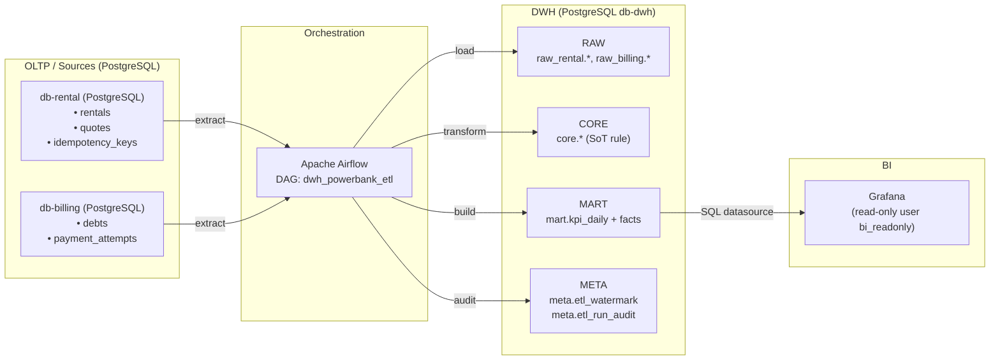

```mermaid
flowchart LR
  subgraph OLTP["OLTP / Sources (PostgreSQL)"]
    RDB["db-rental (PostgreSQL)\n• rentals\n• quotes\n• idempotency_keys"]
    BDB["db-billing (PostgreSQL)\n• debts\n• payment_attempts"]
  end

  subgraph ORCH["Orchestration"]
    AF["Apache Airflow\nDAG: dwh_powerbank_etl"]
  end

  subgraph DWH["DWH (PostgreSQL db-dwh)"]
    RAW["RAW\nraw_rental.*, raw_billing.*"]
    CORE["CORE\ncore.* (SoT rule)"]
    MART["MART\nmart.kpi_daily + facts"]
    META["META\nmeta.etl_watermark\nmeta.etl_run_audit"]
  end

  subgraph BI["BI"]
    GRAF["Grafana\n(read-only user bi_readonly)"]
  end

  RDB -->|extract| AF
  BDB -->|extract| AF
  AF -->|load| RAW
  AF -->|transform| CORE
  AF -->|build| MART
  AF -->|audit| META
  MART -->|SQL datasource| GRAF
```
