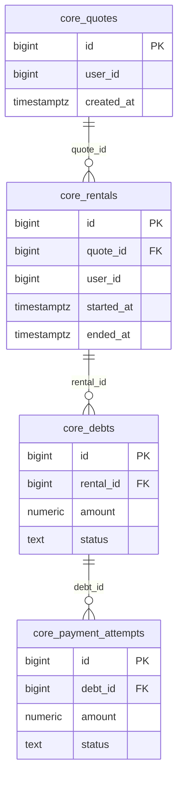

```mermaid
erDiagram
  core_quotes ||--o{ core_rentals : "quote_id"
  core_rentals ||--o{ core_debts : "rental_id"
  core_debts ||--o{ core_payment_attempts : "debt_id"

  core_quotes {
    bigint id PK
    bigint user_id
    timestamptz created_at
  }
  core_rentals {
    bigint id PK
    bigint quote_id FK
    bigint user_id
    timestamptz started_at
    timestamptz ended_at
  }
  core_debts {
    bigint id PK
    bigint rental_id FK
    numeric amount
    text status
  }
  core_payment_attempts {
    bigint id PK
    bigint debt_id FK
    numeric amount
    text status
  }
```
