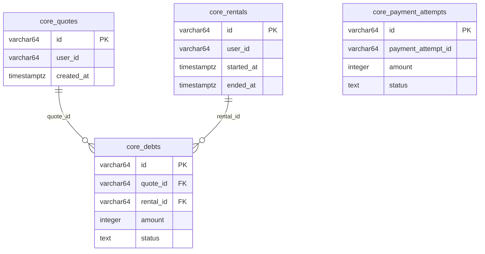

```mermaid
erDiagram
  core_quotes ||--o{ core_debts : "quote_id"
  core_rentals ||--o{ core_debts : "rental_id"

  core_quotes {
    varchar64 id PK
    varchar64 user_id
    timestamptz created_at
  }
  core_rentals {
    varchar64 id PK
    varchar64 user_id
    timestamptz started_at
    timestamptz ended_at
  }
  core_debts {
    varchar64 id PK
    varchar64 quote_id FK
    varchar64 rental_id FK
    integer amount
    text status
  }
  core_payment_attempts {
    varchar64 id PK
    varchar64 payment_attempt_id
    integer amount
    text status
  }
```
